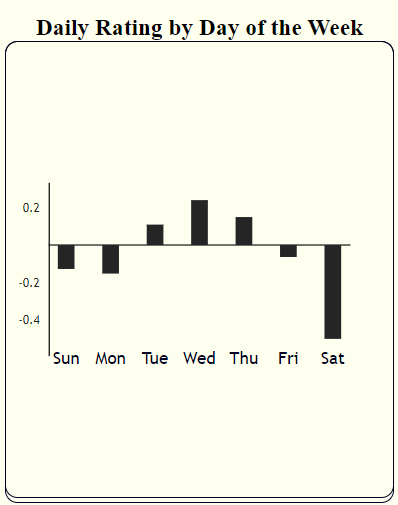

# BugBook Journal

Live App at https://bugbookjournal.com 

## About 
BugBook helps you get to know yourself better through consistent, methodical journaling and simple visualizations. Driven by a spirit of objective, scientific thinking, BugBook helps you learn things about yourself without judgement.

## Screenshots
 <!--  -->
 

 -----------

-------------

  

-----------

## User's can: 
- explore a demo account 
- register for their own account
- log in and out of their account 

- create daily entries 
- edit/delete the day's entry 
- delete past entries 
- create observations 
- view a word cloud of their positive days
- view a graph of their daily rating by day of the week 

## Technology Used: 
- JavaScript/ES6
- React 
- React-router
-  CSS3 / Styled Components
- Victory (for graphs)
- amCharts (for wordclouds)
- fontAwesome (for icons)

### Known Bugs/To-do 
- Registration Router
    - after a successful registration, users will need to navigate to the login page on their own. Need to fix router to auto direct.

- Edit Entry
    - similar to registration, after successful edit, users are not automatically routed back to the timeline. 

- Loading Pages
    - need to implement loading display on fetches. 

- Visualizations 
    - dyanmic word clouds to display positive and negative days based on user input 
    - additional graphs
